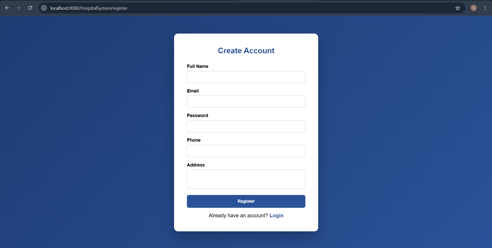
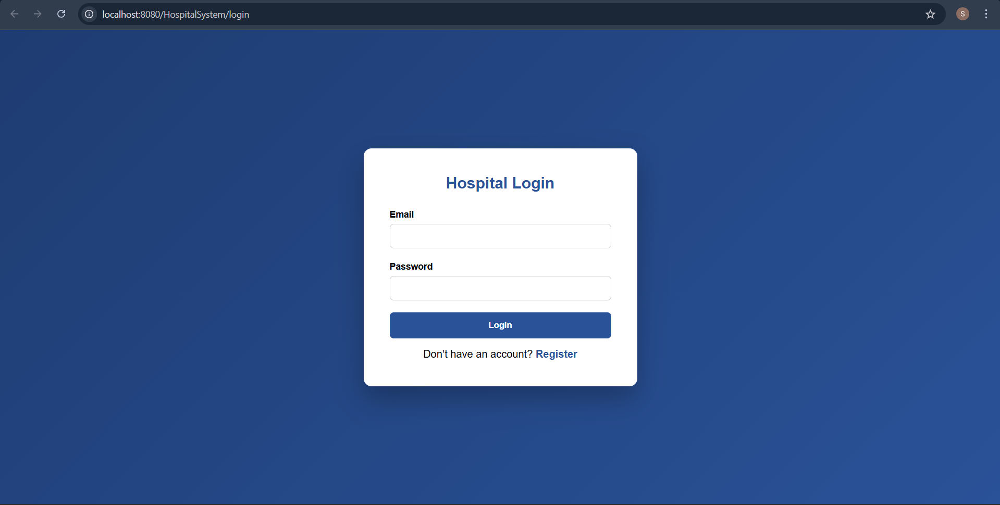
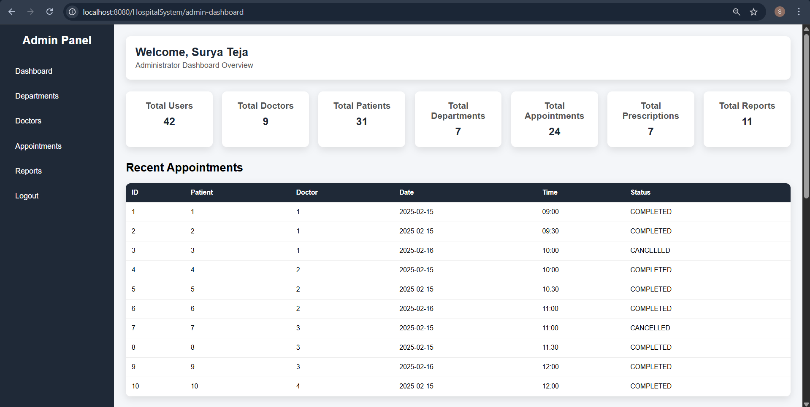
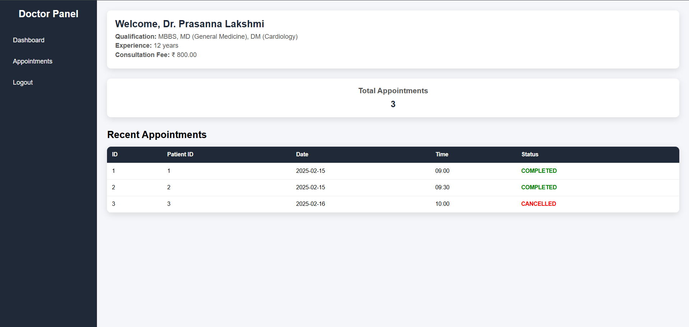
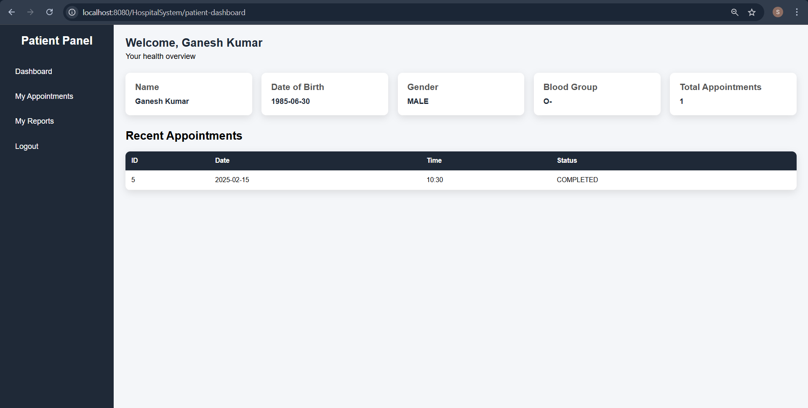
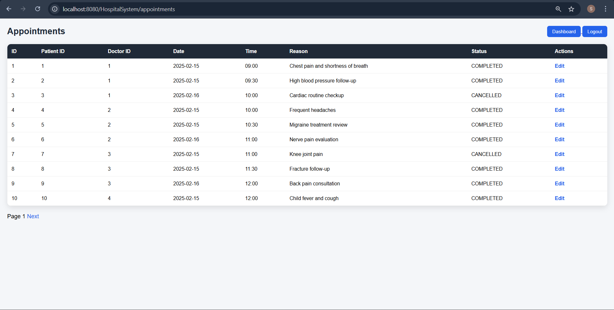
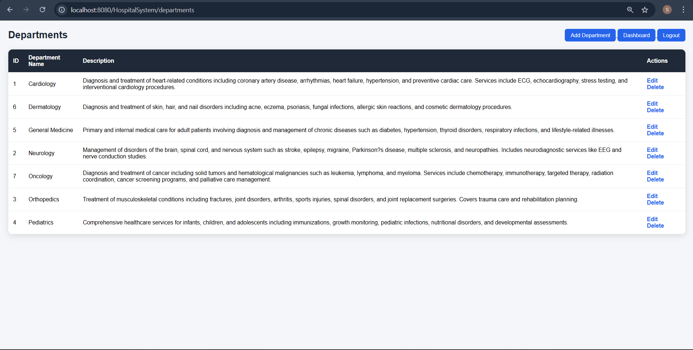
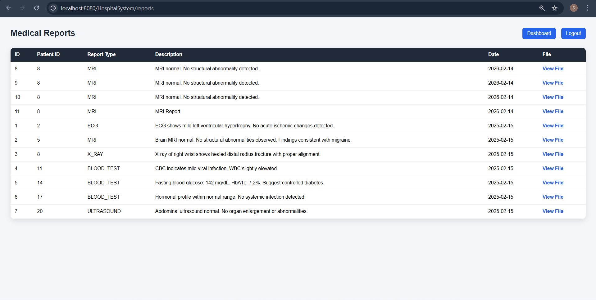

# 🏥 Hospital Management System (HMS)

Enterprise-grade role-based hospital management system for streamlined clinical, administrative, and operational workflows.

---

## 📌 Problem Statement

Hospitals require centralized control over patient records, doctor management, department administration, appointment scheduling, prescriptions, and audit tracking.

Manual or disconnected systems introduce inefficiencies, security risks, and poor traceability.  
This system provides a structured, secure, database-driven platform to manage multi-role healthcare operations in a unified environment.

---

## 👥 Target Users & Capabilities

### 🔐 Admin
- Manage Doctors, Patients, Departments
- Monitor Appointments
- View Audit Logs
- Access system-wide operational data

### 🩺 Doctor
- View assigned appointments
- Manage patient records
- Create prescriptions
- Access medical reports

### 🧑‍⚕️ Patient
- Access dashboard
- View appointments
- View prescriptions
- Access medical reports

---

## 🚀 Technology Stack

- Java 11+
- Jakarta Servlet 6.0 (Jakarta EE 10)
- JSP (Server-Side Rendering)
- JDBC
- MySQL 8.x
- Apache Tomcat 10+
- mysql-connector-j-9.1.0

---

## 🏗 Architecture

### Architecture Style
- Layered Architecture
- MVC Pattern
- DAO Pattern
- Monolithic Deployment

### Layer Breakdown

Presentation Layer → JSP  
Controller Layer → Servlets  
Business Logic → Embedded within Servlets  
Data Access Layer → DAO + DAOImpl  
Model Layer → POJOs  
Security Layer → Filters (AuthFilter, RoleFilter)

### Request Flow

Client → Servlet → DAO → Database → JSP Response

---

## 📦 Major Modules

### 🔐 Authentication Module
- LoginServlet
- LogoutServlet
- Session-based authentication
- Role-based filtering

### 👤 User Management
- Users entity
- Role control and validation

### 👨‍⚕️ Doctor Management
- CRUD operations
- Department mapping
- Consultation fee tracking

### 🧑‍⚕️ Patient Management
- CRUD operations
- Profile management

### 🏥 Department Management
- Department CRUD
- Medical specialization classification

### 📅 Appointment Management
- Book appointments
- Doctor-specific scheduling
- Status tracking (Completed, Cancelled, Scheduled)

### 💊 Prescription Management
- Prescription entity
- Appointment-based linkage
- DAO-driven persistence

### 🧾 Medical Reports Module
- MedicalReports entity
- Database-stored report entries
- Report type classification (MRI, ECG, BLOOD_TEST, etc.)

### 📊 Admin Dashboard
- System overview
- Operational visibility

### 📝 Audit Logging
- Tracks critical system actions
- Maintains traceability

---

## 🔒 Security Implementation

- Session-based authentication
- Role-based authorization
- AuthFilter for login protection
- RoleFilter for endpoint-level access control
- Restricted dashboard access per role
- Direct JSP access prevention

---

## 📁 Project Structure

Hospital_Management_System/
│
├── src/
│ └── main/
│ ├── java/
│ │ └── com/
│ │ └── hospital/
│ │ ├── dao/
│ │ │ ├── AppointmentsDAO.java
│ │ │ ├── AuditLogsDAO.java
│ │ │ ├── DepartmentsDAO.java
│ │ │ ├── DoctorsDAO.java
│ │ │ ├── MedicalReportsDAO.java
│ │ │ ├── PatientsDAO.java
│ │ │ ├── PrescriptionsDAO.java
│ │ │ └── UsersDAO.java
│ │ │
│ │ ├── daoimpl/
│ │ │ ├── AppointmentsDAOImpl.java
│ │ │ ├── AuditLogsDAOImpl.java
│ │ │ ├── DepartmentsDAOImpl.java
│ │ │ ├── DoctorsDAOImpl.java
│ │ │ ├── MedicalReportsDAOImpl.java
│ │ │ ├── PatientsDAOImpl.java
│ │ │ ├── PrescriptionsDAOImpl.java
│ │ │ └── UsersDAOImpl.java
│ │ │
│ │ ├── model/
│ │ │ ├── Appointments.java
│ │ │ ├── AuditLogs.java
│ │ │ ├── Departments.java
│ │ │ ├── Doctors.java
│ │ │ ├── MedicalReports.java
│ │ │ ├── Patients.java
│ │ │ ├── Prescriptions.java
│ │ │ └── Users.java
│ │ │
│ │ ├── servlet/
│ │ │ ├── AdminDashboardServlet.java
│ │ │ ├── AppointmentsServlet.java
│ │ │ ├── DepartmentsServlet.java
│ │ │ ├── DoctorAppointmentsServlet.java
│ │ │ ├── DoctorDashboardServlet.java
│ │ │ ├── DoctorsServlet.java
│ │ │ ├── LoginServlet.java
│ │ │ ├── LogoutServlet.java
│ │ │ ├── PatientDashboardServlet.java
│ │ │ ├── PatientsServlet.java
│ │ │ ├── PrescriptionsServlet.java
│ │ │ ├── RegisterServlet.java
│ │ │ └── ReportUploadServlet.java
│ │ │
│ │ ├── filter/
│ │ │ ├── AuthFilter.java
│ │ │ └── RoleFilter.java
│ │ │
│ │ └── util/
│ │ └── DBConnection.java
│ │
│ └── webapp/
│ ├── META-INF/
│ ├── WEB-INF/
│ │ ├── lib/
│ │ │ └── mysql-connector-j-9.1.0.jar
│ │ └── web.xml
│ │
│ ├── admin-dashboard.jsp
│ ├── appointment-form.jsp
│ ├── appointments.jsp
│ ├── department-form.jsp
│ ├── departments.jsp
│ ├── doctor-dashboard.jsp
│ ├── doctor-appointments.jsp
│ ├── doctor-form.jsp
│ ├── doctors.jsp
│ ├── error.jsp
│ ├── login.jsp
│ ├── patient-dashboard.jsp
│ ├── patient-profile.jsp
│ ├── prescription-form.jsp
│ ├── register.jsp
│ ├── report-form.jsp
│ └── reports.jsp
│
├── database/
│ └── hospital_schema.sql
│
├── screenshots/
│ ├── register.png
│ ├── medical-reports.png
│ ├── doctors.png
│ ├── appointments.png
│ ├── departments.png
│ ├── login.png
│ ├── admin-dashboard.png
│ ├── doctor-dashboard.png
│ └── patient-dashboard.png
│
└── README.md

---

## 🗄 Database

Database: MySQL 8.x  
Connection: JDBC  
Utility Class: DBConnection.java  

Schema file located at:

database/hospital_schema.sql

Includes:
- Referential integrity constraints
- Foreign key relationships
- Audit logging table
- Role-based user model

---

## 📸 Application Screenshots

### 📝 Registration Page

### 🔐 Login Page

### 🧑‍💼 Admin Dashboard

### 🩺 Doctor Dashboard

### 🧑‍⚕️ Patient Dashboard

### 👨‍⚕️ Doctors Management

### 📅 Appointments Management

### 🏥 Departments Management

### 🧾 Medical Reports Module

---

## ⚠ Current Limitations

- No pagination implementation
- No PDF/export report generation
- No physical file upload storage
- Direct JDBC (no ORM abstraction)
- Business logic embedded in Servlets (no service layer)

---

## 📈 Future Enhancements

- Pagination support
- File-based report storage
- PDF report export
- Spring Boot migration
- REST API layer
- Docker containerization
- CI/CD pipeline integration
- Unit and integration testing

---

## 📄 License

Educational and portfolio demonstration project.

## 👨‍💻 Author

**Surya Teja **  
Java Full Stack Developer  
Specialized in scalable backend systems, RESTful API architecture, Spring ecosystem, and production-grade application design.

📧 Email: suryateja36200@gmail.com  
🌍 Location: India  
🔗 GitHub: https://github.com/Surya63023  

### ⭐ If you found this project useful, consider giving it a star.
